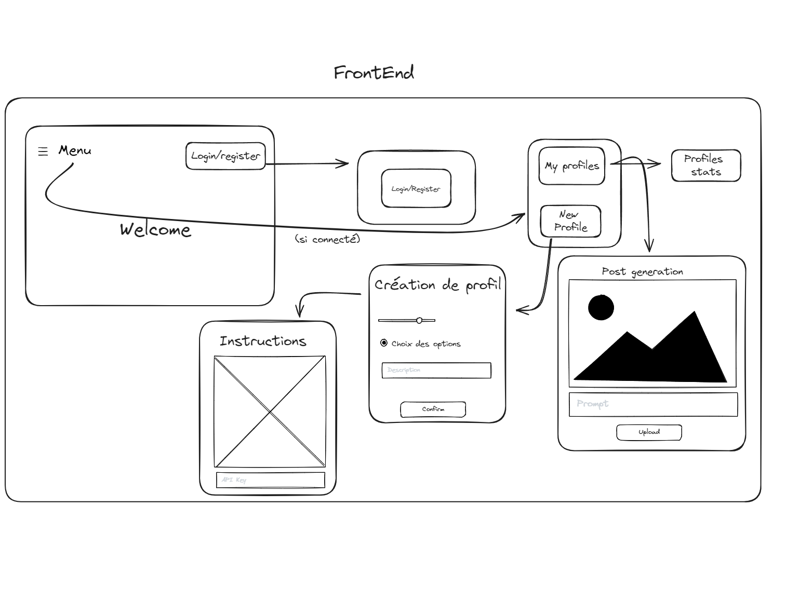
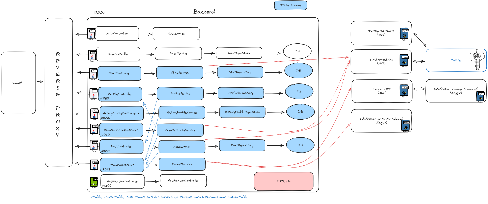

# InfluGenerator
Generate Instagram creators using Fooocus (picture generation tool) and Llama2 (language generation model) with personality.

## Description
This project is composed of multiple backend in spring boot, multiple backend in python and one bakcend in node.JS. 
The frontend is in ReactJS. 
* Fooocus : https://github.com/lllyasviel/Fooocus
* Llama : 
    * https://ai.meta.com/llama/
    * https://huggingface.co/TheBloke/CodeUp-Llama-2-13B-Chat-HF-GGUF
* API Twitter : https://developer.twitter.com/en/docs/twitter-api
* Gradio : https://www.gradio.app/
* Script Kaggle pour Fooocus : https://www.kaggle.com/louismessie/fooocusrunnning
* Script Kaggle pour Llama : https://www.kaggle.com/code/baillivetchloe/notebookf2d9851de6
* Ngrok : https://ngrok.com/
* FastApi : https://fastapi.tiangolo.com/
* Compte Twitter de InfluGenerator : https://twitter.com/influgenerator

## Visuals
### Connexion

```plantuml
actor client
participant AuthService as Auth
participant UserService as User
participant StatService as Stat
participant ProfileService as Profile
participant HistoryProfileService as Hist
participant CreateProfileService as Create
participant PostService as Post
participant PromptService as Prompt
entity InstagramAPI as Insta
entity FooocusAPI as Fooocus
entity LlamaAPI as Llama

client -> Auth : Log In/Account Creation
Auth -> User : Check Credentials
User --> Auth : OK
Auth -> client : OK
```

### Post
```plantuml
actor client
participant AuthService as Auth
participant UserService as User
participant StatService as Stat
participant ProfileService as Profile
participant HistoryProfileService as Hist
participant CreateProfileService as Create
participant PostService as Post
participant PromptService as Prompt
entity InstagramAPI as Insta
entity FooocusAPI as Fooocus
entity LlamaAPI as Llama

client -> Profile : getProfiles()
Profile -> User : getProfilesIds()
User -> Profile : IdList[]
Profile -> client : profileList[]

client -> Post : createPost()
Post -> client : wait : int idPost

Post -> Profile : getProfileHistory()
Profile -> Hist : getHistory()
Hist -> Profile
Profile -> Post : history

Post -> Prompt : newPrompt()
Prompt --> Post : int : promptId
Prompt -> Prompt : queue()
Prompt -> Fooocus
Fooocus -> Prompt : URL 
Prompt -> Llama
Llama-> Prompt : texte

Prompt -> Post : updateProfile(promptId,URL,texte)
Post -> Insta : newPost()
Insta -> Post : OK

Post -> Profile : updateHist()
Profile -> Hist : update()
Hist -> Profile : ok
Profile -> Post : ok

Post -> notifService : newPost()
notifService -> client : newPost()
```

### CreateProfile

```plantuml
actor client
participant AuthService as Auth
participant UserService as User
participant StatService as Stat
participant ProfileService as Profile
participant HistoryProfileService as Hist
participant CreateProfileService as Create
participant PostService as Post
participant PromptService as Prompt
entity InstagramAPI as Insta
entity FooocusAPI as Fooocus
entity LlamaAPI as Llama


client -> Profile : getProfiles()
Profile -> User : getProfilesIds()
User -> Profile : IdList[]
Profile -> client : profileList[]

client -> Create : newProfile(params[])
Create -> client : WAIT : idProfile

Create -> Prompt : newProfile(params[])
Prompt --> Create : int : promptId
Prompt -> Prompt : queue()
Prompt -> Llama : generateProfile(params[])
Llama -> Prompt : text
Prompt -> Fooocus : generateProfile(params[])
Fooocus -> Prompt : URL

Prompt -> Create : updateProfile(promptId,text,URL)
Create -> Hist : newHist()
Hist -> Create : int histId

Create -> Profile : newProfile(idProfile,histId,URL,texte)
Profile -> Create : ok
Create -> notifService : profileCreated : int idProfile
notifService -> client : profileCreated : int idProfile
```

## Architecture
### FrontEnd


### BackEnd


## Installation
### BackEnds
    * Run the two kaggle notebooks for Fooocus and Llama
    * Verify the IP of deployed projects and change it in the nginx.conf 
    * Launch docker with this command : "docker run --rm --name projet-majeur -p 80:80 -v <absolute-path>\nginx.conf:/etc/nginx/nginx.conf:ro nginx"
    * Launch  apache-activemq-5.16.4 with this command in the folder of activemq : "bin\activemq start"
    * Follow the README.md in Backend folder 

[Backend README.md](./Backend/README.md)

### FrontEnd


## Contributing
Author :
* AMMAR Selim
* BAILLIVET Chloe
* MESSIE Louis
* PERREYON Thomas

https://www.youtube.com/watch?v=BUuIG0JGGaQ

Thanks to :
 * SARAYDARYAN Jacques


